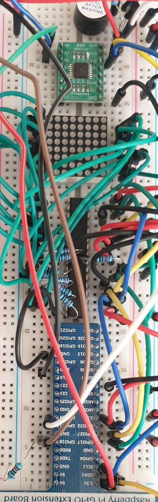

# Simple 2 player game with rpi
## Components
---
### - Rpi
### - Breadboard
### - GPIO Extension
### - LED Matrix
### - 74HC595 (2x)
### - Buzzer
### - NPN Transistor
### - ADC Module
### - Resistors
### - Joystick
### - Keyboard
---

